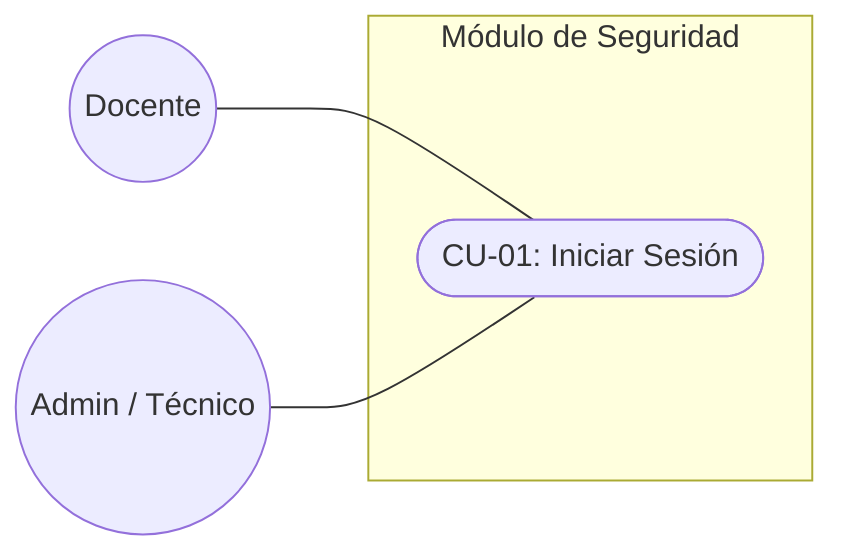
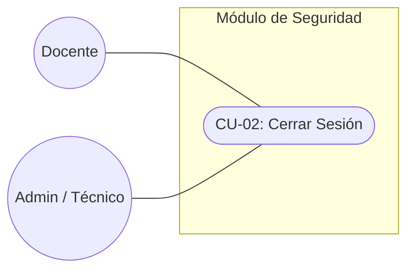
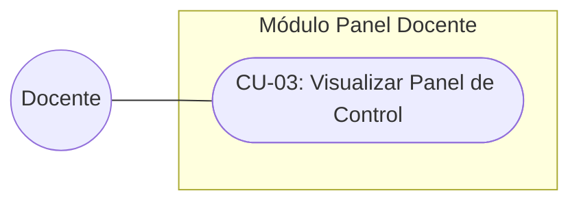
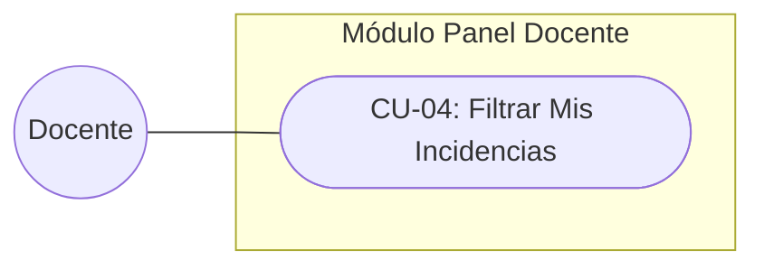
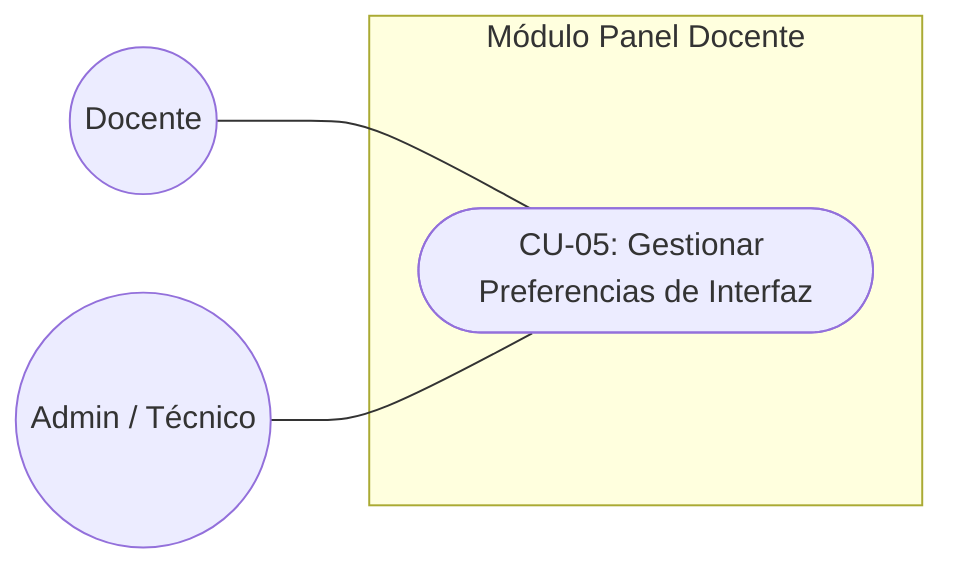
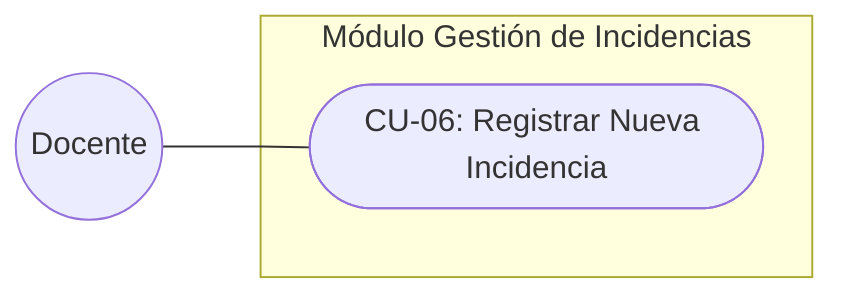
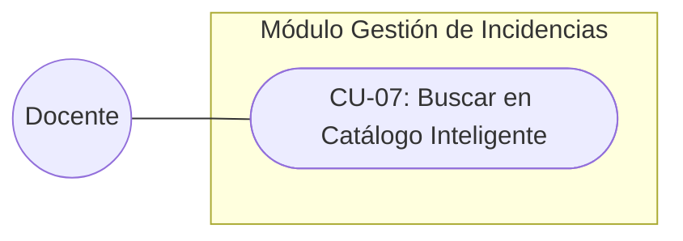
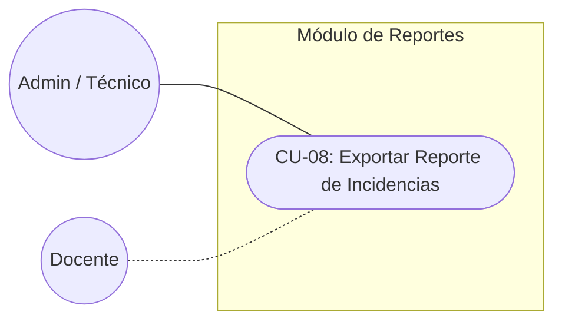

# 📘 Documentación de Casos de Uso - Sistema de Gestión de Incidentes (SGI)

Este documento detalla los Casos de Uso del sistema, ilustrando las interacciones directas entre los actores (Docentes, Técnicos/Administradores) y el sistema. 

---

## 🔒 Módulo de Seguridad y Autenticación

### CU-01: Iniciar Sesión
**Actores:** Docente, Técnico / Administrador
**Descripción:** Permite a un usuario autenticarse en el sistema. El sistema valida las credenciales y, de ser correctas, le otorga acceso a los módulos correspondientes según su rol.

### CU-02: Cerrar Sesión
**Actores:** Docente, Técnico / Administrador
**Descripción:** Permite al usuario finalizar su sesión activa de forma segura, destruyendo sus credenciales temporales en el servidor y redirigiéndolo a la pantalla de inicio.

---

## 📊 Módulo del Panel Docente

### CU-03: Visualizar Panel de Control (Dashboard)
**Actores:** Docente
**Descripción:** El sistema presenta al docente un resumen de sus tickets históricos, mostrando contadores actualizados (Pendientes, En Proceso, Resueltas) y la lista detallada de sus reportes.

### CU-04: Filtrar Mis Incidencias
**Actores:** Docente
**Descripción:** El usuario puede aplicar filtros rápidos en su panel para visualizar únicamente las tarjetas de incidencias que coincidan con un estado específico.

### CU-05: Gestionar Preferencias de Interfaz
**Actores:** Docente, Técnico / Administrador
**Descripción:** Permite al usuario alternar entre el "Modo Claro" y el "Modo Oscuro" de la interfaz gráfica. El sistema recuerda esta preferencia localmente.

---

## 🛠 Módulo de Gestión de Incidencias

### CU-06: Registrar Nueva Incidencia
**Actores:** Docente
**Descripción:** El docente completa un formulario detallando el problema (ubicación, categoría, prioridad). El sistema registra la información y la asocia a su cuenta.

### CU-07: Buscar en Catálogo Inteligente
**Actores:** Docente
**Descripción:** Durante la creación de una incidencia, el docente utiliza un buscador interactivo que le sugiere problemas comunes estandarizados directamente desde la base de datos del sistema.

---

## 📈 Módulo de Inteligencia de Negocio / Soporte

### CU-08: Exportar Reporte de Incidencias
**Actores:** Técnico / Administrador (Y Docente si se habilita)
**Descripción:** El usuario solicita un consolidado de las incidencias. El sistema procesa los datos y genera un archivo Excel (.xlsx) listo para su descarga y análisis.

